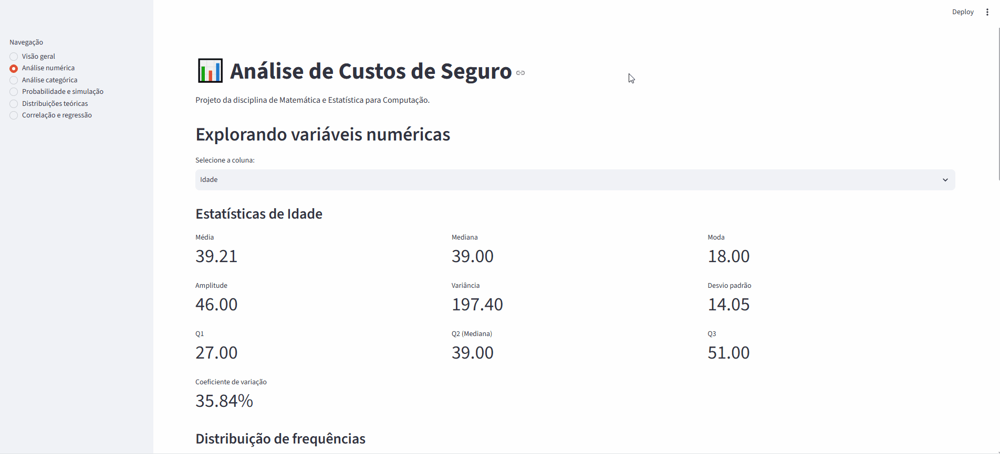
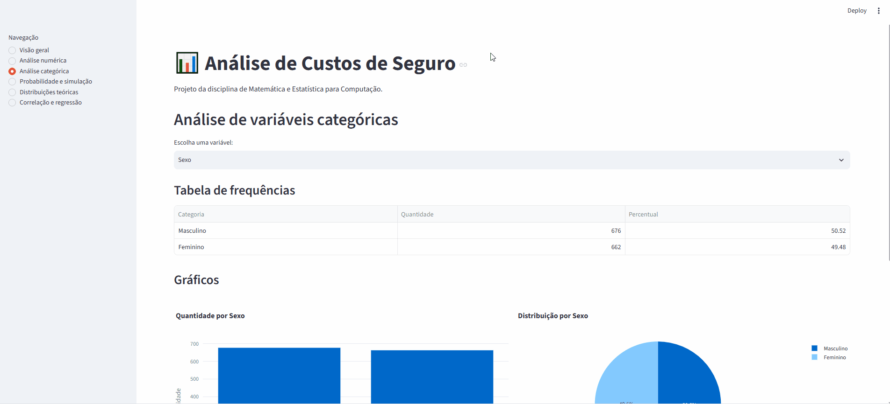
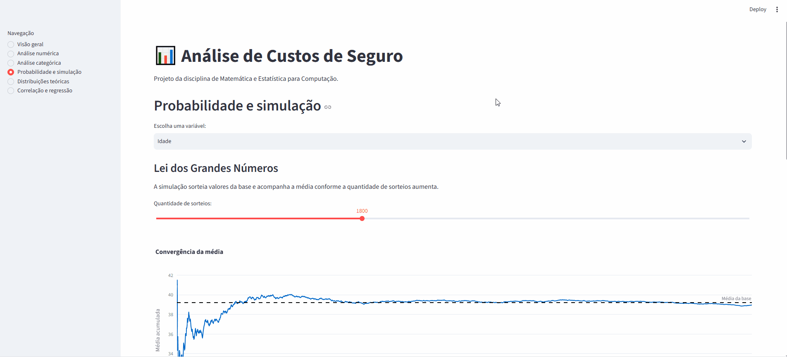
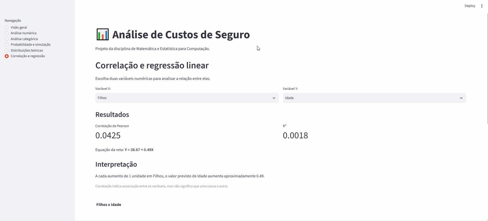

Artur de Amorim Porto Carreira 
RA: 72601777

# Sistematização da disciplina de Matemática e Estatística para Computação - Turma B - 0726

## SOBRE O PROJETO
Foi utilizada uma base de dados de custos de seguros de saúde para aplicar, de forma prática, os conteúdos estudados durante a disciplina.

Foi desenvolvida uma aplicação interativa em Python utilizando Streamlit. A aplicação permite explorar os dados e realizar análises estatísticas por meio de diferentes módulos.

Entre as funcionalidades implementadas estão:
- Estatística descritiva
- Tabelas de frequência e gráficos
- Identificação de outliers
- Análise de variáveis categóricas
- Simulações relacionadas à Lei dos Grandes Números
- Simulação do Teorema Central do Limite
- Comparação com distribuições teóricas
- Correlação de Pearson
- Regressão linear
- Comparação dos custos entre fumantes e não fumantes

As principais funções estatísticas utilizadas pela aplicação foram implementadas no arquivo `minhastats.py`. As bibliotecas NumPy e SciPy foram utilizadas nos testes para comparar e validar os resultados obtidos pelas funções próprias.

### DATASET
Foi utilizado o arquivo `insurance.csv`, composto por 1.338 registros e 7 variáveis:

- `age` — idade
- `sex` — sexo
- `bmi` — índice de massa corporal (IMC)
- `children` — quantidade de filhos/dependentes
- `smoker` — condição de fumante
- `region` — região de residência
- `charges` — custos médicos associados ao seguro

Fonte original: https://www.kaggle.com/datasets/mirichoi0218/insurance

## EXECUTANDO O PROJETO
Para executar o projeto, primeiro clone o repositório para o computador e abra a pasta do projeto. Em seguida, crie o ambiente virtual utilizando o comando `python -m venv .venv`. No Windows PowerShell, ative o ambiente virtual com o comando `.\.venv\Scripts\Activate.ps1`.

Com o ambiente virtual ativado, instale as dependências necessárias utilizando o comando `pip install -r requirements.txt`. Após a instalação, os testes das funções estatísticas podem ser executados com o comando `python -m pytest -v`.

Para iniciar a aplicação, execute o comando `python -m streamlit run app.py`. Após a inicialização, o Streamlit exibirá no terminal o endereço da aplicação, que poderá ser acessado pelo navegador.

## DEMONSTRAÇÃO DA APLICAÇÃO
### Análise numérica

### Análise categórica

### Probabilidade e simulação

### Correlação e regressão
