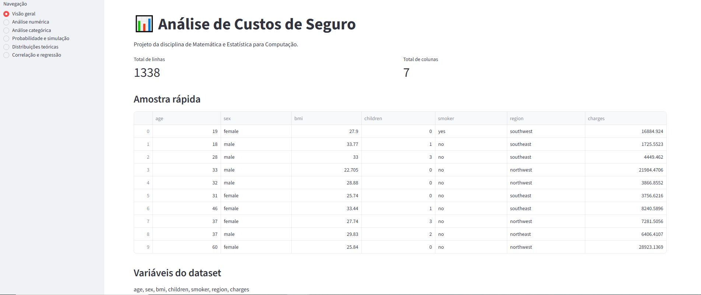

# Relatório da Sistematização

## 1. Dataset escolhido e justificativa

Para o desenvolvimento deste trabalho, optou-se pela utilização do dataset insurance.csv, que reúne informações referentes aos custos de seguros de saúde. A base é composta por 1.338 registros e 7 variáveis, englobando atributos numéricos (idade, índice de massa corporal - IMC, número de filhos e custos associados) e categóricos (sexo, condição de fumante e região).

A escolha desse conjunto de dados também esteve relacionada ao próprio tema abordado. Custos ligados à saúde e a seguros são informações que possuem aplicação prática e permitem investigar como diferentes características dos indivíduos podem estar associadas a variações nas despesas. Variáveis como idade, IMC e condição de fumante tornam possível realizar comparações intuitivas e levantar questões interessantes sobre o comportamento dos custos, tornando a análise mais próxima de uma situação real.

Ao mesmo tempo, buscou-se uma base relativamente simples e objetiva. O insurance.csv possui poucas variáveis, todas de fácil compreensão, mas ainda apresenta diversidade suficiente para produzir análises relevantes. Isso permitiu desenvolver o trabalho sem a necessidade de etapas complexas de tratamento ou interpretação de dezenas de atributos, mantendo o foco nos conceitos estatísticos estudados durante a disciplina.

O volume da base também foi considerado para a escolha. A quantidade registros é suficiente para trabalhar com amostragens, simulações e comparações estatísticas, sem tornar a aplicação excessivamente pesada. Dessa forma, o conjunto de dados apresentou um bom equilíbrio entre quantidade de informações, simplicidade de interpretação e viabilidade para o desenvolvimento das análises propostas.

## 2. Núcleo estatístico próprio

### 2.1 Decisões de implementação

Uma das principais propostas do trabalho foi desenvolver um núcleo estatístico próprio, sem utilizar funções prontas de bibliotecas como o NumPy para realizar os cálculos. Para isso, foi criado o arquivo minhastats.py, concentrando as operações matemáticas utilizadas ao longo do projeto.

A implementação foi mantida propositalmente simples, utilizando estruturas básicas de Python, como listas, laços de repetição, condicionais e operações aritméticas. A intenção foi manter os cálculos visíveis e compreensíveis, permitindo acompanhar como cada resultado é obtido em vez de apenas chamar uma função pronta de outra biblioteca.

Foram criadas funções proprias para média, mediana, moda, amplitude, variância, desvio padrão, percentis, quartis, coeficiente de variação, covariância e correlação de Pearson, distribuições Normal, Exponencial e regressão linear.

Algumas decisões específicas também foram adotadas durante o desenvolvimento. No cálculo da moda, por exemplo, caso mais de um valor apresente a mesma frequência máxima, é retornado o menor deles. Para variância, desvio padrão e covariância foram mantidas versões compatíveis com cálculos amostrais, utilizando divisão por n - 1 quando necessário. Já os percentis foram calculados a partir da ordenação dos dados e da interpolação entre os valores vizinhos quando a posição encontrada não correspondia exatamente a um índice da lista.

As bibliotecas externas continuaram sendo utilizadas no projeto para manipulação dos dados, criação dos gráficos e validação dos resultados, mas os principais cálculos estatísticos apresentados ao usuário foram realizados pelas funções desenvolvidas no minhastats.py.

### 2.2 Fórmulas utilizadas

Para o desenvolvimento do núcleo estatístico, as fórmulas matemáticas utilizadas ao longo do trabalho foram implementadas diretamente em Python. Quando aplicável, foram mantidas versões populacionais e amostrais dos cálculos.

**Medidas de Tendência Central**

**Média Aritmética:**

A média é calculada pela soma de todos os valores dividida pela quantidade de elementos.

$$
\bar{x} = \frac{1}{n}\sum_{i=1}^{n}x_i
$$

**Mediana:**

Os valores são inicialmente ordenados. Quando a quantidade de elementos é ímpar, é utilizado o valor central. Quando a quantidade é par, é calculada a média dos dois valores centrais.

$$
Md = \frac{x_{(n/2)} + x_{(n/2)+1}}{2}
$$

**Moda:**

A moda é obtida pela contagem da frequência de cada valor. O valor que aparece mais vezes é retornado pela função. Em caso de empate entre valores com a mesma frequência máxima, foi definido que o menor deles seria utilizado.

**Medidas de Dispersão**

**Amplitude:**

A amplitude representa a diferença entre o maior e o menor valor do conjunto.

$$
A = x_{max} - x_{min}
$$

**Variância Populacional:**

$$
\sigma^2 = \frac{1}{n}\sum_{i=1}^{n}(x_i-\bar{x})^2
$$

**Variância Amostral:**

Na versão amostral, a divisão é realizada por $n-1$.

$$
s^2 = \frac{1}{n-1}\sum_{i=1}^{n}(x_i-\bar{x})^2
$$

**Desvio Padrão Populacional:**

$$
\sigma = \sqrt{\frac{1}{n}\sum_{i=1}^{n}(x_i-\bar{x})^2}
$$

**Desvio Padrão Amostral:**

$$
s = \sqrt{\frac{1}{n-1}\sum_{i=1}^{n}(x_i-\bar{x})^2}
$$

**Coeficiente de Variação:**

O coeficiente de variação relaciona o desvio padrão amostral com a média dos valores e apresenta o resultado em percentual.

$$
CV = \left(\frac{s}{\bar{x}}\right)\times100
$$

**Percentis e Quartis**

Para o cálculo dos percentis, os valores são primeiro colocados em ordem crescente. A posição referente ao percentual desejado é calculada por:

$$
pos = (n-1)\frac{p}{100}
$$

Quando a posição calculada fica entre dois elementos, é realizada uma interpolação entre os valores vizinhos. Os quartis utilizam o mesmo cálculo, sendo Q1 correspondente ao percentil de 25%, Q2 ao de 50% e Q3 ao de 75%.

**Associação entre Variáveis**

**Covariância Amostral:**

$$
Cov(X,Y) =
\frac{1}{n-1}
\sum_{i=1}^{n}
(x_i-\bar{x})(y_i-\bar{y})
$$

**Correlação de Pearson:**

A correlação de Pearson utiliza a covariância e os desvios padrão amostrais das duas variáveis.

$$
r =
\frac{Cov(X,Y)}
{s_x \cdot s_y}
$$

**Distribuições Teóricas de Probabilidade**

**Função de Densidade da Distribuição Normal:**

$$
f(x) =
\frac{1}{\sigma\sqrt{2\pi}}
e^{-\frac{(x-\mu)^2}{2\sigma^2}}
$$

**Função de Densidade da Distribuição Exponencial:**

$$
f(x) = \lambda e^{-\lambda x}
\quad \text{para } x \geq 0
$$

**Regressão Linear**

Para a regressão linear, primeiro é calculada a inclinação da reta utilizando a covariância entre X e Y e a variância amostral de X.

$$
b =
\frac{Cov(X,Y)}
{s_x^2}
$$

O intercepto da reta é calculado utilizando as médias das duas variáveis:

$$
a = \bar{y} - b\bar{x}
$$

A equação utilizada para realizar as previsões é:

$$
\hat{Y} = a + bX
$$

**Coeficiente de Determinação (R²):**

O coeficiente de determinação compara os erros entre os valores observados e os valores previstos pela regressão com a variação total dos valores de Y.

$$
R^2 =
1 -
\frac{\sum_{i=1}^{n}(y_i-\hat{y}*i)^2}
{\sum*{i=1}^{n}(y_i-\bar{y})^2}
$$

Essas fórmulas correspondem aos cálculos implementados no arquivo `minhastats.py` e utilizados pelos diferentes módulos da aplicação.

### 2.3 Validação das funções

Após a implementação do núcleo estatístico, foram criados testes automatizados no arquivo test_minhastats.py com o objetivo de verificar se os resultados produzidos pelas funções próprias estavam corretos. Para isso, foram utilizadas principalmente as bibliotecas NumPy e SciPy como referência de comparação, sem que essas bibliotecas fossem usadas para realizar os cálculos apresentados pela aplicação.

Nos testes foram comparados os resultados de média, mediana, moda, amplitude, variância populacional e amostral, desvio padrão populacional e amostral, percentis, quartis, coeficiente de variação, covariância e correlação de Pearson. As funções de densidade das distribuições Normal e Exponencial também foram comparadas com os resultados equivalentes do SciPy. Para a regressão linear, foram validados o intercepto, a inclinação da reta e o valor de R² utilizando a função de regressão disponível no SciPy apenas como referência.

Como os cálculos estatísticos trabalham frequentemente com números decimais, foi adotada uma tolerância de 1e-4 nas comparações. Essa margem evita que pequenas diferenças causadas pela representação de números em ponto flutuante sejam consideradas erros, mesmo quando os resultados são estatisticamente equivalentes.

Além das comparações com bibliotecas externas, também foram incluídos alguns testes específicos do comportamento definido durante a implementação. Entre eles estão o tratamento de empate na moda, a verificação de percentis fora do intervalo permitido e um teste simples para confirmar o funcionamento da função de previsão da regressão.

Ao final do desenvolvimento, o conjunto de testes possuía 20 verificações automatizadas, todas executadas com sucesso. Dessa forma, foi possível confirmar que os cálculos implementados no minhastats.py apresentavam resultados compatíveis com as bibliotecas utilizadas como referência, dando maior segurança para utilizá-los nos diferentes módulos da aplicação.

## 3. Módulos da aplicação
### Módulo 0 — Dados Reais
No primeiro módulo foi realizada a preparação da base utilizada durante todo o projeto. O arquivo insurance.csv foi incorporado à estrutura da aplicação e carregado com o Pandas para permitir a leitura e manipulação dos registros.

Como primeira verificação, foi criada uma tela de visão geral que apresenta a quantidade de linhas e colunas do dataset, uma amostra dos primeiros registros e a relação das variáveis disponíveis. Essa etapa serviu principalmente para confirmar que o arquivo estava sendo carregado corretamente e para permitir uma primeira visualização da estrutura dos dados antes do início das análises estatísticas.

A base utilizada possui 1.338 registros e 7 variáveis, reunindo dados numéricos e categóricos que posteriormente foram usados nos outros módulos da aplicação.

### Módulo 1 — Núcleo Estatístico Próprio

### Módulo 2 — Estatística Descritiva Interativa

### Módulo 3 — Probabilidade e Simulação

### Módulo 4 — Distribuições Teóricas

### Módulo 5 — Correlação e Regressão Linear

## 4. Relatório de Descobertas
### Descoberta 1
A análise da variável de custos revela que a distribuição dos dados não ocorre de maneira uniforme, apresentando uma forte concentração em faixas de menor valor. Embora a média registrada seja de 13270,42, a mediana encontra-se em um patamar bem inferior, fixada em 9382,03. Esse distanciamento entre as duas métricas indica claramente que um pequeno grupo de valores muito altos está puxando o resultado médio para cima, o que pode distorcer a interpretação do cenário financeiro caso a avaliação se baseie apenas na média de forma isolada.

Esse comportamento assimétrico fica evidente ao observarmos a representação gráfica, onde a maior parte dos registros se agrupa no início do eixo, formando uma longa cauda à direita no histograma devido às despesas excepcionalmente maiores. Consequentemente, a variabilidade dos dados torna-se bastante expressiva. O coeficiente de variação atingiu 91,26%, apontando uma dispersão altíssima em relação à própria média. Além disso, a aplicação do método do Intervalo Interquartil (IQR) reforçou essa característica ao identificar 139 outliers, que correspondem justamente a esses custos atípicos e elevados.

Conclui-se, portanto, que a maior parte dos registros está concentrada em despesas baixas e intermediárias. Já os valores extremos, embora representem uma parcela menor da base, exercem forte influência sobre a média e aumentam de forma significativa a dispersão geral dos custos analisados.

Média: 13270,42
Mediana: 9382,03
Desvio padrão: 12110,01
Coeficiente de variação: 91,26%
Valores atípicos (outliers): 139
Coeficiente de assimetria de Pearson: 0,96
Apoio visual: Histograma e Boxplot da variável Custos

### Descoberta 2
Ao investigar a relação entre a idade e os custos, a análise estatística apontou uma tendência de crescimento conjunto, embora com baixa intensidade. O coeficiente de correlação de Pearson resultou em 0,2990, indicando que de forma geral, os custos tendem a subir à medida que a idade avança. Contudo, por se tratar de um valor distante de 1, essa relação linear é considerada fraca. Esse comportamento reflete-se visualmente no diagrama de dispersão, onde a reta de regressão exibe uma inclinação ascendente, mas os pontos de dados permanecem bastante espalhados ao seu redor.

Para quantificar essa dinâmica, a regressão linear gerou o modelo expresso pela equação Y = 3165,89 + 257,72X. Na prática, o coeficiente aponta que, para cada ano adicional de idade, há um incremento projetado de aproximadamente 257,72 nos custos. Apesar dessa tendência de alta, o coeficiente de determinação (R²) obtido foi de apenas 0,0894. Isso demonstra que a idade consegue explicar menos de 9% de toda a variação dos custos presente na base de dados, limitando fortemente a capacidade preditiva do modelo se utilizado de forma isolada.

O ponto mais importante dessa análise é que, embora exista uma associação positiva entre idade e custos, a idade isoladamente não consegue explicar a maior parte das diferenças observadas na base. Esse resultado é relevante porque uma análise superficial poderia levar à impressão de que o aumento da idade seria suficiente para explicar o crescimento dos custos, quando o próprio R² mostra que essa relação representa apenas uma pequena parcela da variação total. Dessa forma, considerar apenas essa tendência poderia levar a uma interpretação incompleta dos dados. Além disso, a correlação observada indica apenas uma associação entre as variáveis e não estabelece uma relação de causalidade, o que sugere que outros fatores também precisam ser considerados para compreender melhor as diferenças de custos.

### Descoberta 3
A comparação entre fumantes e não fumantes revelou uma das discrepâncias mais marcantes de toda a análise. Embora os fumantes representem uma minoria na base de dados, totalizando 274 registros (20,48%), contra 1.064 não fumantes (79,52%), esse grupo apresentou um custo médio de 32050,23. Esse montante contrasta drasticamente com a média de 8.434,27 observada entre o grupo que não possui o hábito de fumar.

Essa diferença substancial fica visualmente explícita no gráfico de barras, evidenciando que o custo médio entre os fumantes é quase quatro vezes maior. Trata-se de um diferença muito mais pronunciado sobre os valores do que as tendências observadas anteriormente nas análises isoladas de variáveis como idade ou IMC.

Portanto, a condição de fumante apresenta uma forte associação com custos mais elevados. No entanto, mantendo o rigor estatístico das análises de correlação, não é possível atestar causalidade direta baseando-se unicamente neste cruzamento, visto que outras variáveis podem atuar em conjunto com o tabagismo. O que se pode concluir com segurança é que a divisão por essa categoria expõe uma diferença marcante na base, consolidando o hábito de fumar como uma variável relevante para a compreensão do comportamento dos custos.

Resumo dos Indicadores
Custo médio dos fumantes: 32050,23
Custo médio dos não fumantes: 8434,27
Proporção de fumantes: 274 registros (20,48%)
Proporção de não fumantes: 1.064 registros (79,52%)
Apoio visual: Gráfico de barras comparativo do custo médio entre as categorias de fumantes e não fumantes.